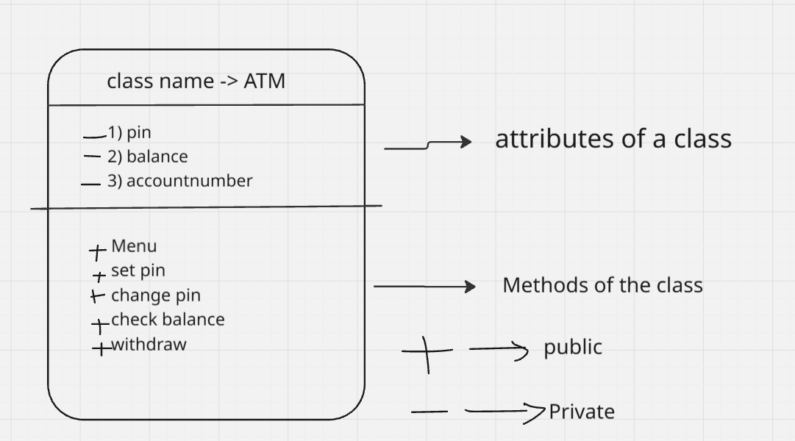

classes and objects in python

OOP is Object oriented programming 

what problem does OOP solve ? 
-> the normal code we write is genral code (top to bottom),but when we use OOP concepts , we write more specific code ,thus OOP helps us to move from generality to specificity.

* OOP gives the programmer an ability to create its own data types -> this is important and main advantage of oop 
thus,

what is OOP ?
-> OOP is a programming paradigm (way of writing code) using which a programmer can create his own data types.
besides this , many other important concepts like abstraction , inheritance , encapsulation and polymorphism , help writing structerd code. 

IMPORTANT OOP principles : 
1> Classes and Objects
2> polymorphism
3> Encapsulation
4> Inheritance
5> Abstraction

----------------------------------------------------------------------------------------------------------------------------------
1> Class : 

what is Class in OOP? 
-> Class is a blueprint, it is a set of rules which are created , which must be followed by each object belonging to that class

eg -> consider there  is a course , there will be some structure/schedule of the course which will be followed throughout the course , and will be obeyed by each student in the course. 
thus,course is the class and each student enrolling in the course will be an object of that class.

other examples ->
class : car , objects : wagonR , swift , G wagon etc..

all the data types in python are built in classes , and when we create a variable using any datatype , python considers it as an object of that class 

---------------------------------------------------------------------------------------------------------------------------------
Class contains 2 things -> 
1> The data or property or attributes of the class 
2> Functions or behaviour of that class 

eg =>
for a class : course , 
the attributes are -> the curriculum , instructor , fees , exam schedule etc
the methods / functions are -> attending lectures , giving exams, asking doubts etc 

--------------------------------------------------------------------------------------------------------------------------------
Object -> 
Object is an instance of the class , 
for an class course: object is student , like wise for a class car the object is wagonR etc.

--------------------------------------------------------------------------------------------------------------------------------
basic implementation example -> 
if we create a new list "nums" , then nums will be the object of the class list, thus whenever we print "nums." , 
we see a dropdown of muliple options like append , clear , copy , sort etc 
these options are nothing but the methods / attributes of that class.

to create an object of a class we use the format -> objectname = classname()
to implement the attribute we use the format -> object.MethodName()
----------------------------------------------------------------------------------------------------------------------------------
a class cannot be executed , unless we do not execute the object beloning to that particular class.
eg -> a course will only be conducted if students enroll in it , if no student enrolls , then the properties and attributes of that course is useless . 
thus without an object the class cannot be executed
----------------------------------------------------------------------------------------------------------------------------------
In python there are 2 types of clasess -> 1) built in and 2) user defined classes 
---------------------------------------------------------------------------------------------------------------------------------
constructor ->it is a special function where variables are created for each instance
we do not need to call the constructor of a class manually , when we create an object for the class the constructor is called.

----------------------------------------------------------------------------------------------------------------------------------
Methods vs Fucntion : 
All the functions present inside the Class are called as METHODS and the functions present outside of the class are called as 
functions 

eg -> L = [1,2,3]
len(L) -> is a function 
L.append(4) -> is a method 

len(L) is a function because , when we do L. we do not see the option length
---------------------------------------------------------------------------------------------------------------------------------
any created class can be represented by a diagram 

----------------------------------------------------------------------------------------------------------------------------------
MAGIC METHODS / Dunder Methods 
magic methods are special methods , every magic methods has a super power , it is represented using 

__methodname__ 

eg-> constructor -> __init__ is a magic method and its superpower is that it can be implemented without calling , it can be impemented by creating an object of the class 
----------------------------------------------------------------------------------------------------------------------------------
Detailed discussion on constructor : 
1) What is a constructor
-> Constructor is a method , but it is a special one , and we do not need to call it , it is triggered when the object is called.

2) what is the benifit of constructor ? 
-> since the code inside the constuctor is implemented whenever new instance is created , all the basic attributes and other basic implementations which are must for every object can be wirtten in the constructor , thus whenever we create a new object we do not need to repeat the things evertime , thus we follow the DRY principle.
Also all those things in the application whose control we dont want to give to the user will be present in the constructor . 

eg -> configuration related code (eg-> connecting to database)

3) we cannot rename constructor in python , the only name for the constructer in python is __init__