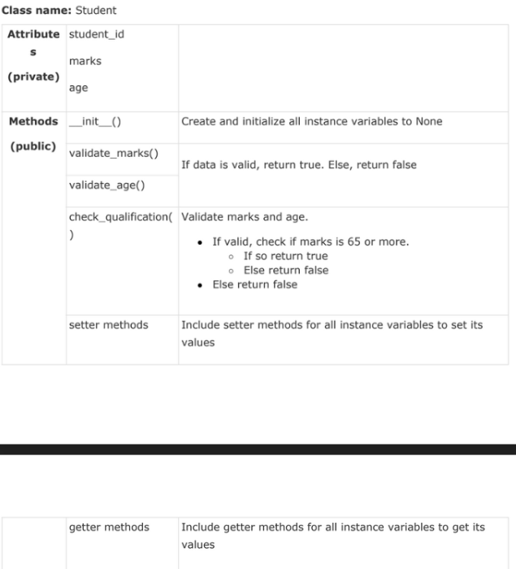

Q-5: Problem 5
Statement: A university wants to automate their admission process. Students are admitted based on the marks scored in the qualifying exam. A student is identified by student id, age and marks in qualifying exam. Data are valid, if:

Age is greater than 20
Marks is between 0 and 100 (both inclusive)
A student qualifies for admission, if

Age and marks are valid and
Marks is 65 or more
Write a python program to represent the students seeking admission in the university. The details of student class are given below.
